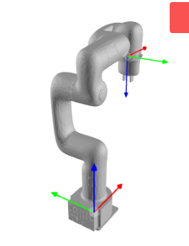
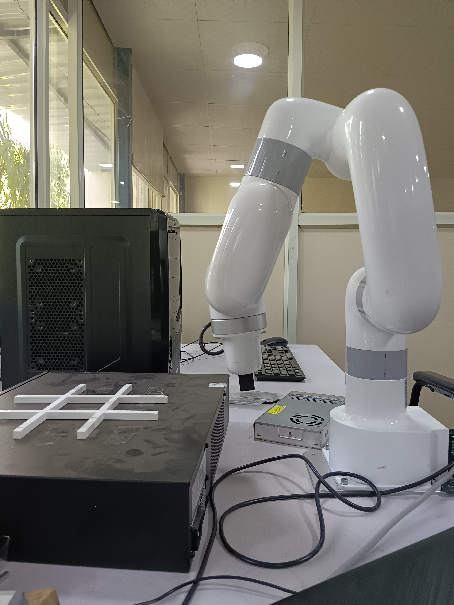
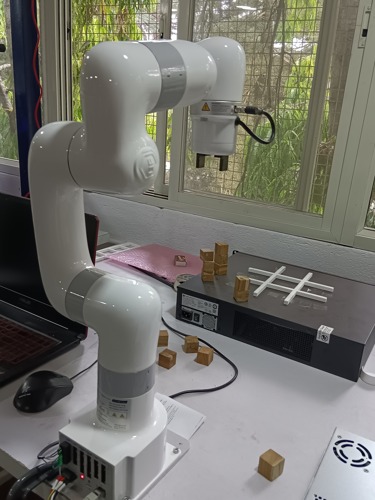

# Experiment Setup Guide

This readme explains the exisiting experiments and also how to create an experiment from scratch. It covers defining poses, locations, and actions using the YAML config files.

## Prerequisites
Ensure the following setups are completed before proceeding:

### 1. Robot-Server Connection
Open the `main_sess0` tab in the terminator of the robot app.
Look for the message:
```
"Sync command executed successfully"
```
This confirms the robot-server connection is established.

If this message does not appear, troubleshoot by:
- Re-running both the server and robot, and checking the configuration setup.
- Ensuring the network connection is stable.
- Pinging the robot's IP:
  ```
  ping 192.168.1.111
  ```
  to verify the robot is connected to the app.

### 2. GUI Tools
- **Server App:** Ensure RViz and Gazebo launch without errors.
- **Robot App:** Ensure RViz launches without errors.

### 3. xArm Setup
The orientation of xArm x, y, z coordinates and roll, pitch, yaw directions are denoted in the following image.
- The base of the Arm has axis for linear motion
    - x (Red arrow),
    - y (green arrow),
    - z (blue arrow) denotes positive direction for each.
- The gripper has red, green and blue axis of rotation for roll, pitch and yaw respectively.



---
The home position of the robot is:
```yaml
Pose: {x: 20, y: 0, z: 20, roll: 3.14, pitch: 0, yaw: 0}
```
Here the pose x, y, z are measured in centimeters and pose roll, pitch, yaw in radians.



## Understanding `0_stack.yaml`
The `0_stack.yaml` file defines robot poses, and task sequences for the stacking experiment.

### Poses
Poses define specific positions in 3D space for robot movement:
- **x, y, z:** Coordinates for robotic arm movement in 3D space.
- **roll, pitch, yaw:** Orientation of the gripper.

Example pose definitions:
```yaml
out1: {x: 20, y: 0, z: 50, roll: 3.14, pitch: 0, yaw: 0}
```
`out1` is the default position from where the experiment starts.



## Targets
Targets define the sequence of robot movements and actions.

Example Actions Breakdown:
```yaml
- Move to out1
- Pick from above1
- Place at above4
- Pick from above2
- Place at above5
- Pick from above3
- Place at above6
- Move to out1
```

## Understanding `4_destack.yaml`
The `4_destack.yaml` file defines robot poses, and task sequences for the destacking experiment.

### Poses
Poses define specific positions in 3D space for robot movement:
- **x, y, z:** Coordinates for robotic arm movement in 3D space.
- **roll, pitch, yaw:** Orientation of the gripper.

Example pose definitions:
```yaml
out1: {x: 20, y: 0, z: 50, roll: 3.14, pitch: 0, yaw: 0}
```
`out1` is the default position from where the experiment starts.

## Targets
Targets define the sequence of robot movements and actions.

Example Actions Breakdown:
```yaml
- Move to out1
- Pick from above6
- Place at above3
- Pick from above5
- Place at above2
- Pick from above4
- Place at above1
- Move to out1
```

## Running the Experiment

### Step 1: Load the Experiment
Run the following command on the server:
```bash
ras_cli load_experiment <experiment_name>
```
This command loads the destacking experiment using the `ras_sim_lab` repository.

### Step 2: Run the Simulation Robot
Run the following command:
```bash
ras_cli run_sim_robot
```
This starts the behavior tree (BT) execution, which follows the XML configuration at:
```yaml
/ras_server_app/ros2_ws/src/common_pkg/ras_bt_framework/xml/sim.xml
```
If successful, the log will show:
```
"BT Execution Successful"
```

### Step 3: Run the Real Robot
Run the command:
```bash
ras_cli run_real_robot
```
Check the Robot App logs for:
```
"Connected to MQTT Broker"
"Connected to FileServer"
```
These messages confirm a successful connection to the FileServer.

## Trajectory and File Generation
A trajectory is generated based on the simulation and saved at:
```yaml
ras_docker/ros2_pkgs/ras_bt_framework/xml/
```
The robot downloads and executes this trajectory, ensuring synchronization between the simulation and real-world execution.

Upon successful execution, the logs will display:
```
"Behavior Tree Execution Successful"
```

The server logs will confirm:
```
Result success: true, Goal finished with status: SUCCEEDED
```

## Steps to create your own experiment

### Step 1: Create a YAML File
- Create a new YAML file inside config/experiments/ with a meaningful experiment name, e.g., stacking.yaml.

### Step 2: Define Poses
- Poses represent key locations for the robot during the experiment. Each pose includes:
  - Position (x, y, z) in centimeters,
  - Orientation (roll, pitch, yaw) in radians,
  - and a name (Ex-out1, in1 etc) to have a better understanding to that pose.
 
### Step 3: Define Targets
- The targets defines the sequence of actions the robot will execute.
- For example:
```yaml
- Move to out1 (any default position)
- Move to location1 (first object location)
- Pick the object at location1
- Place the object at goal_location
- repeat above actions with objects placed at different locations
- Move to out1 (get back to default position)
```

## Workspace Dimensions for xArm Lite 6
The xArm Lite 6 has the following workspace dimensions:
- X (Forward-Backward): Approximately -44 cm to 44 cm
- Y (Left-Right): Approximately -44 cm to 44 cm
- Z (Up-Down): Approximately 0 cm to 55 cm
All defined poses should fall within these limits to ensure valid robot operation.
