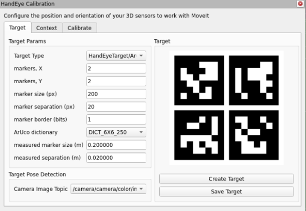
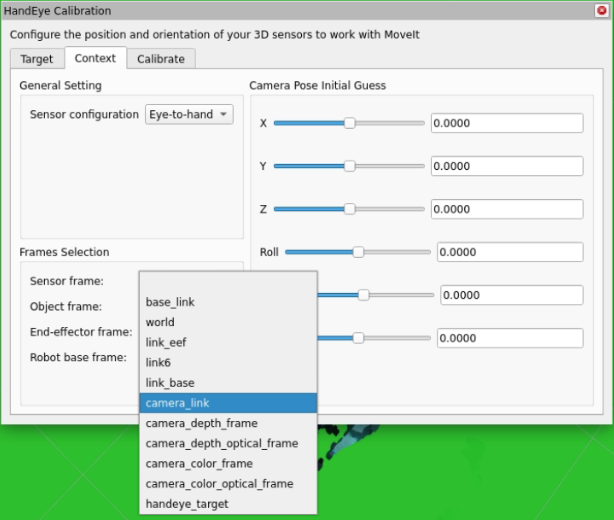
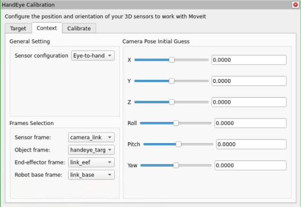
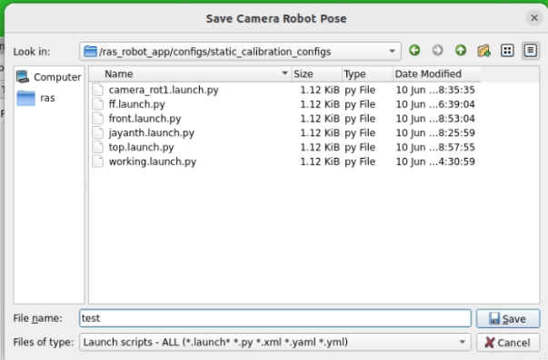

# RAS MoveIt Hand-Eye Calibration

This document explains the hand-eye calibration process for the RAS (Robot Automation System) using MoveIt and ROS 2. Hand-eye calibration is essential for accurate robot manipulation tasks where visual information from a camera needs to be transformed into the robot's coordinate system.


## Overview

Hand-eye calibration establishes the transformation between:
- The robot's base_link (hand)
- The camera (eye) mounted on the robot or fixed in the workspace

Two common configurations are supported:
1. **Eye-in-Hand**: Camera mounted on the robot's end-effector
2. **Eye-to-Hand**: Camera fixed in the workspace, observing the robot

## Prerequisites

- RAS Docker environment set up and running
- ROS 2 Humble with MoveIt packages installed
- A calibration target (ArUco marker board or checkerboard)
- Robot arm with proper end-effector configuration
- Camera with ROS 2 driver properly configured

## Required Hardware

- Robot arm (xArm or compatible)
- RGB camera (Intel RealSense or compatible)
- Calibration target (printed ArUco marker board or checkerboard)

## Software Components

- `ras_moveit` package with calibration modules
- `easy_handeye2` ROS 2 package for calibration algorithms
- Camera driver (e.g., `realsense2_camera`)
- ArUco marker detection (`ros2_aruco` package)

## Getting Started

While it is possible to go through most of this tutorial using just a simulation, to actually complete a calibration you will need a robotic arm and a camera.

Make sure your arm is set up to work with MoveIt and that you have a camera publishing images and a `sensor_msgs/CameraInfo` topic with good intrinsic calibration parameters and an accurate coordinate frame. If necessary, conduct an intrinsic camera calibration using the `camera_calibration` package first.

## Calibration Setup

### Eye-in-Hand Setup

In the eye-in-hand configuration, the camera is rigidly mounted on the robot's end-effector.

### Eye-to-Hand Setup

1. Mount the camera in a fixed position with a clear view of the robot's workspace
2. Attach the calibration target to the robot's end-effector
3. Ensure the target is visible to the camera throughout the calibration process

## Calibration Process

### 1. Launch the RAS Application Environment

```bash
# Start the RAS environment
ras robot run
```

### 2. Launch RViz and Load Calibration Plugin

In the RViz "Displays" panel, click "Add" and select the "HandEyeCalibration" display type. The display will be added with the "Target" tab active.


### 3. Create and Print a Target

In the "Target Params" section of the "Target" tab, configure the target parameters:

- **markers, X**: 2
- **markers, Y**: 2
- **marker size (px)**: 200
- **marker separation (px)**: 20
- **marker border (bits)**: 1
- **ArUco dictionary**: DICT_6X6_250



Press the "Create Target" button to create the target image, then save and print it. The target must be flat to be reliably localized by the camera.

Measure the marker width (the outside dimension of one of the black squares) and the separation distance between markers. Enter these values, in meters, in the appropriate boxes in the "Target Params" section.

### 4. Configure Geometric Context

The "Context" tab contains the geometric information necessary to conduct the calibration:

1. Set the "Sensor configuration" to "Eye-in-hand" or "Eye-to-hand"(used in this case) as appropriate
2. The "Sensor frame" is the camera optical frame (using the right-down-forward standard)

3. The "Object frame" is the frame defined by the calibration target (default: "handeye_target")

4. The "End-effector frame" is the robot link rigidly attached to the camera

5. The "Robot base frame" is the frame in which the calibration target is stationary


after all the parameters are set ,move to next tab.



### 5. Collect Calibration Dataset

Next, capture a calibration dataset with multiple samples to ensure a good calibration:

1. On the "Calibrate" tab, select which calibration solver to use (andreff1999 solver is recommended)
2. Set the "Planning Group" to the appropriate group for your arm(lite6 in this case)


#### Manual Calibration Method

1. When the target is visible in the camera and the axis is rendered on the target, click "Take sample"
2. Move the arm to a new pose and take another sample
3. Be sure to include some rotation between each pair of poses, and don't always rotate around the same axis
4. At least five samples are required, but 12-15 samples typically provide the best results

#### Automated Calibration Method

1. If you have previously saved joint states, you can use the "Load joint states" option
2. Click the "Load joint states" button and select your saved joint states file(calibration_Joints.yaml in this case)
3. The system will automatically move the robot through the saved poses
4. For each pose press Plan and then Execute, the system will take a sample when the target is detected
5. This method ensures consistent and repeatable calibration results


### 6. Calculate and Save Calibration

1. Once you have collected five samples, a calibration will be performed automatically
2. The calibration will improve with more samples and typically plateaus after about 12-15 samples
3. The position and orientation will be displayed on the "Context" tab
4. Click "Save camera pose" to export the calibration result
5. Save the calibration result in the calibration folder(ras_robot_app/configs/static_calibration_configs/)


6. The saved calibration result will be used by the robot(fake_tf.py) to transform the camera frame to the robot base frame , mention the file name in the lab_setup.yaml file(label: static_calibration_file) which is in configs/

## Troubleshooting

### Common Issues

- **High Calibration Error**: Collect more samples with greater pose variation
- **Target Not Detected**: Check lighting conditions and camera focus
- **Transformation Error**: Verify that all frame IDs are correct in the configuration
- **Robot Movement Issues**: Ensure the robot is properly connected and operational
- **Poor Calibration Results**: Make sure to include rotation around at least two different axes between samples

### What the Calibration Solves

The calibration process solves for the unknown rigid transform between the camera frame and the robot base frame (for eye-to-hand), or between the camera and end-effector (for eye-in-hand). The classic formulation is:

AX = XB

Where:

- A is the motion of the end-effector between two robot poses (in the robot base frame)
- B is the motion of the calibration target as seen by the camera (in the camera frame)
- X is the unknown transform (camera-to-base or camera-to-end-effector, depending on configuration)

### Verification

To verify your calibration:
1. Place an object in the workspace
2. Detect the object with the camera
3. Command the robot to move to the object's position
4. The robot should accurately reach the object

## References

- [MoveIt Documentation](https://moveit.ros.org/)
- [MoveIt Calibration](http://www.github.com/moveit/moveit_calibration)
- [Daniilidis Hand-Eye Calibration Paper](https://scholar.google.com/scholar?cluster=11338617350721919587)
- [easy_handeye2 Package](https://github.com/AndrejOrsula/easy_handeye2)
- [ROS 2 ArUco](https://github.com/JMU-ROBOTICS-VIVA/ros2_aruco)
