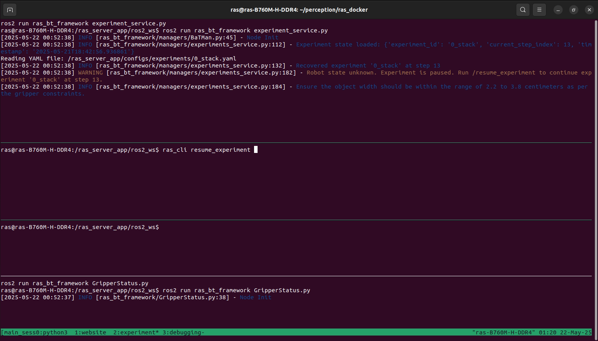
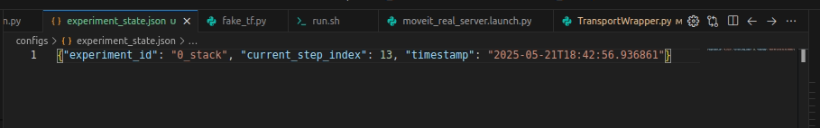

# RAS Experiment Management Guide

This guide provides instructions on how to resume experiments and start experiments from specific steps in the RAS Docker environment.

## Table of Contents
- [Resuming an Experiment](#resuming-an-experiment)
- [Starting an Experiment from a Specific Step](#starting-an-experiment-from-a-specific-step)


## Resuming an Experiment

If your experiment execution was interrupted due to server restart or any other reason, follow these steps:

### 1. When Server is executed again
 
You will be prompted to resume the experiment, as shown in the image below:



This shows the last executed step and the experiment name.

### 2. To Resume the Experiment

To resume the experiment from where it was interrupted, run the following command:

```bash
ras_cli resume_experiment
```

## Starting an Experiment from a Specific Step

If you want to skip certain steps and start an experiment from a specific point, follow these instructions:

### 1. Open the Experiment State File

Locate and open the `experiment_state.json` file in the `configs/` directory.

The file contains information like this:
```json
{"experiment_id": "0_stack", "current_step_index": 13, "timestamp": "2025-05-21T18:42:56.936861"}
```

### 2. Start from a Specific Step

To start an experiment from a specific step:

1. Edit the `experiment_state.json` file
2. Change the `current_step_index` to the step you want to start from
3. You can also change the experiment name in the `experiment_id` field if needed
4. Kill the `experiment_service.py` process and Run it again.
5. you will be promted again to resume the experiment.
6. Run the following command to start the experiment from the specified step:
```bash
ras_cli resume_experiment
```
