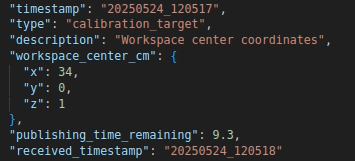

# RAS Workspace Calibration

This document explains the workspace calibration process for the RAS (Robot Automation System) workspace using ArUco markers.

## Prerequisites

- 4 ArUco markers (IDs: 0, 1, 2, 3)
- Camera system with ArUco detection capabilities
- MQTT broker running
- Robot application with perception module
- Server application with calibration subscriber

## Calibration Setup

1. Place the 4 ArUco markers at the four corners of your workspace in a rectangular formation.
   - Marker ID 0: Bottom-left corner
   - Marker ID 1: Bottom-right corner
   - Marker ID 2: Top-right corner
   - Marker ID 3: Top-left corner


2. Ensure the markers are:
   - Clearly visible to the camera
   - Lying flat on the workspace surface
   - Forming a proper rectangle

## Calibration Process

1. The `aruco_calibration.py` script (running in the robot's perception module) will:
   - Detect the 4 ArUco markers
   - Calculate the center point of the workspace i.e,(TARGET)
   - Publish the calibrated workspace center (x, y, z in centimeters) to MQTT topic:
     ```
     robot/calibration_command
     ```


2. The server application's `calibration_target_subscriber.py` will:
   - Subscribe to the MQTT topic `robot/calibration_command`
   - Receive the calibrated center point coordinates
   - Store the data in `calibration_data.json`



## Using Calibration in Experiments

In your experiment configuration file, you can enable or disable the use of calibration data using the `use_calibration` flag:

```yaml
use_calibration: true  # or false
```

### Behavior Based on Flag(example for same experiment file - 0_stack.yaml)

- **When `use_calibration: false` (default):**
  - All object positions in the experiment file are relative to the robot's base_link (0,0,0)


- **When `use_calibration: true`:**
  - All object positions in the experiment file are relative to the calibrated workspace center point i.e,(TARGET example here x=34cm and y=0cm)
  - The system will automatically adjust coordinates based on the stored calibration data


## Calibration Data Format

The calibration data is stored in `calibration_data.json` with the following format:

```json
{
    "workspace_center": {
        "x": 0.0,
        "y": 0.0,
        "z": 0.0
    },
    "timestamp": "2025-05-25T11:02:22.123456"
}
```

## Troubleshooting

- If calibration fails, ensure:
  - All 4 ArUco markers are clearly visible
  - The markers are placed in the correct order (IDs 0-3)
  - The MQTT broker is running and accessible
  - The camera has a clear, unobstructed view of all markers

## Notes

- The calibration remains valid until the markers are moved or the workspace is reconfigured
- To recalibrate, simply restart the calibration process
- The z-coordinate represents the height of the workspace surface relative to the robot's base
