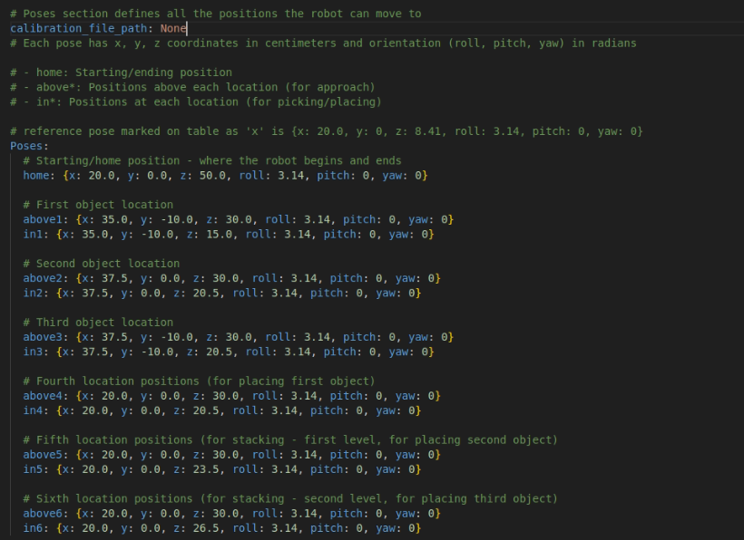

# RAS Workspace Calibration

This document explains the workspace calibration process for the RAS (Robot Automation System) workspace using ArUco markers.

## Prerequisites

- 4 ArUco markers (IDs: 0, 1, 2, 3)
- Camera system with ArUco detection capabilities
- MQTT broker running
- Robot application with perception module
- Server application with calibration subscriber

## Calibration Setup

1. Place the 4 ArUco markers at the four corners of your workspace in a rectangular formation.
   - Marker ID 0: Bottom-left corner
   - Marker ID 1: Bottom-right corner
   - Marker ID 2: Top-right corner
   - Marker ID 3: Top-left corner


2. Ensure the markers are:
   - Clearly visible to the camera
   - Lying flat on the workspace surface
   - Forming a proper rectangle

## Calibration Process

Launch the server application and robot application

```bash
ras server run
```

```bash
ras robot run
```
next run the calibration command
from server to trigger calibration script in robot

```bash
ras_cli calibrate
```
 This will run the calibration script(aruco_calibration.py) in robot and keep sending the calibration data to server(in same terminal where calibration command is run).


When the user is satisfied with the calibration data, the user can stop the calibration process by pressing 'Enter' key.
The user will prompted to give a custom name for the calibration json file ,if user does not give a name, the default name will be used (xarm_calibration_{timestamp}.json).


The calibration data is nothing but the center point of the workspace(4 ArUco markers) TARGET point mentioned in the image.


When the calibration is running in robot, the server can view the live feed of the calibration process in the rqt_gui which is launched in the new window when the calibration command is run.


Select the calibration topic(aruco_calibration/processed_image/compressed) to view the live feed of the calibration process.


## Using Calibration in Experiments

In your experiment configuration file, you can enable or disable the use of calibration data using the `calibration_file_path` flag:

```yaml
calibration_file_path: test.json  # or None
```

### Behavior Based on Flag(example for same experiment file - 0_stack.yaml)

- **When `calibration_file_path: None` (default):**
  - All object positions in the experiment file are relative to the robot's base_link (0,0,0)



- **When `calibration_file_path: {custom_name/default_name}.json`:**
  - All object positions in the experiment file are relative to the calibrated workspace center point i.e,(TARGET example here x=34cm and y=0cm)
  - The system will automatically adjust coordinates based on the stored calibration data


## Calibration Data Format

The calibration data is stored in `calibration_data.json` with the following format:

```json
{
    "calibration": {
        "x": 32,
        "y": 0,
        "z": 0,
        "timestamp": "2025-06-09 15:16:30"
    },
    "saved_at": "2025-06-09 15:16:31"
}
```

## Troubleshooting

- If calibration fails, ensure:
  - All 4 ArUco markers are clearly visible
  - The markers are placed in the correct order (IDs 0-3)
  - The MQTT broker is running and accessible
  - The camera has a clear, unobstructed view of all markers

## Notes

- The calibration remains valid until the markers are moved or the workspace is reconfigured
- To recalibrate, simply restart the calibration process
- The z-coordinate represents the height of the workspace surface relative to the robot's base
