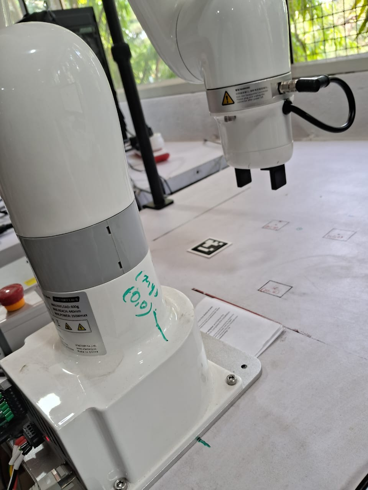
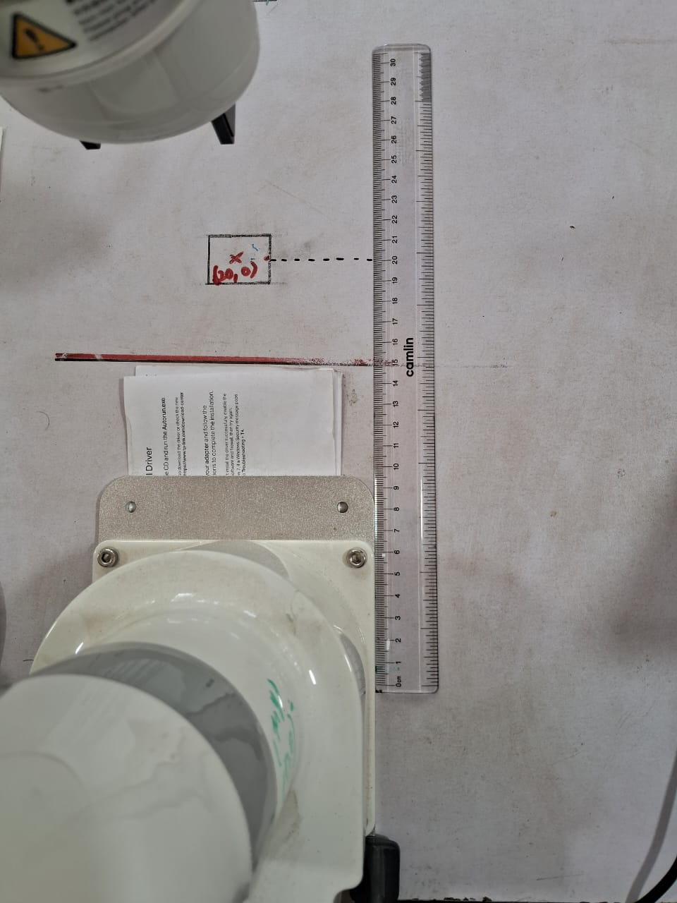
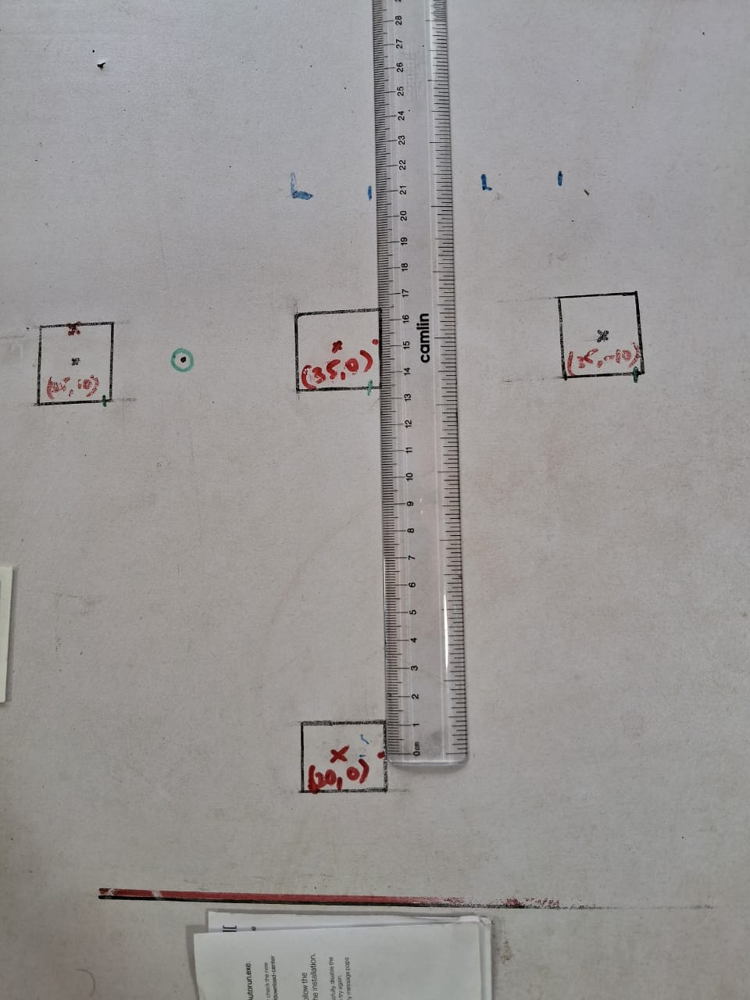
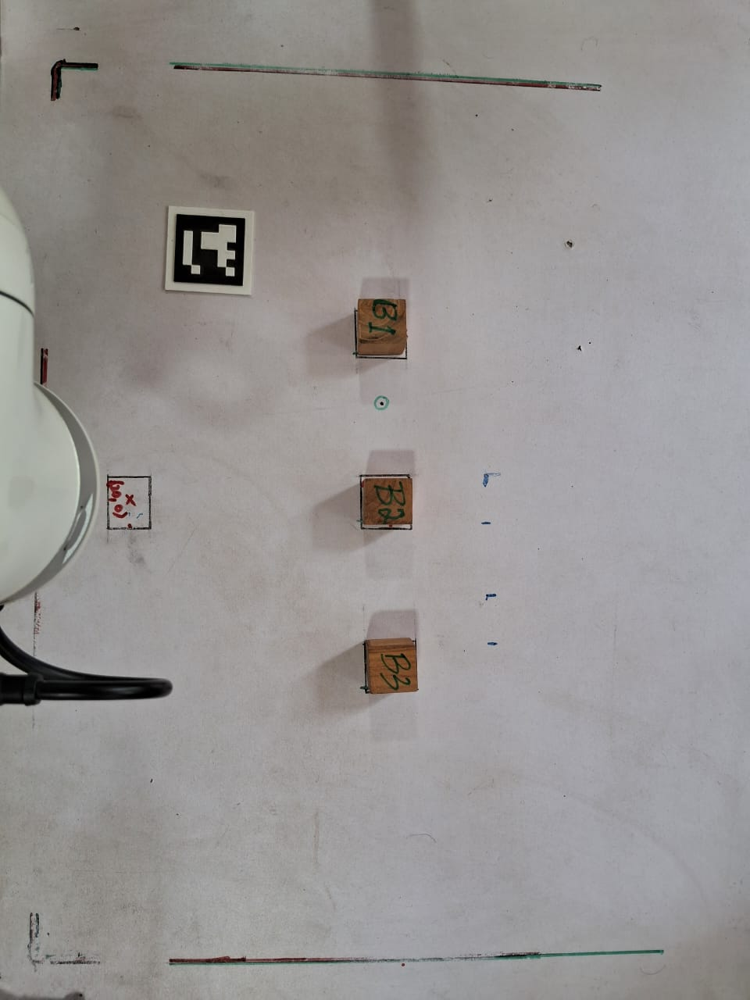
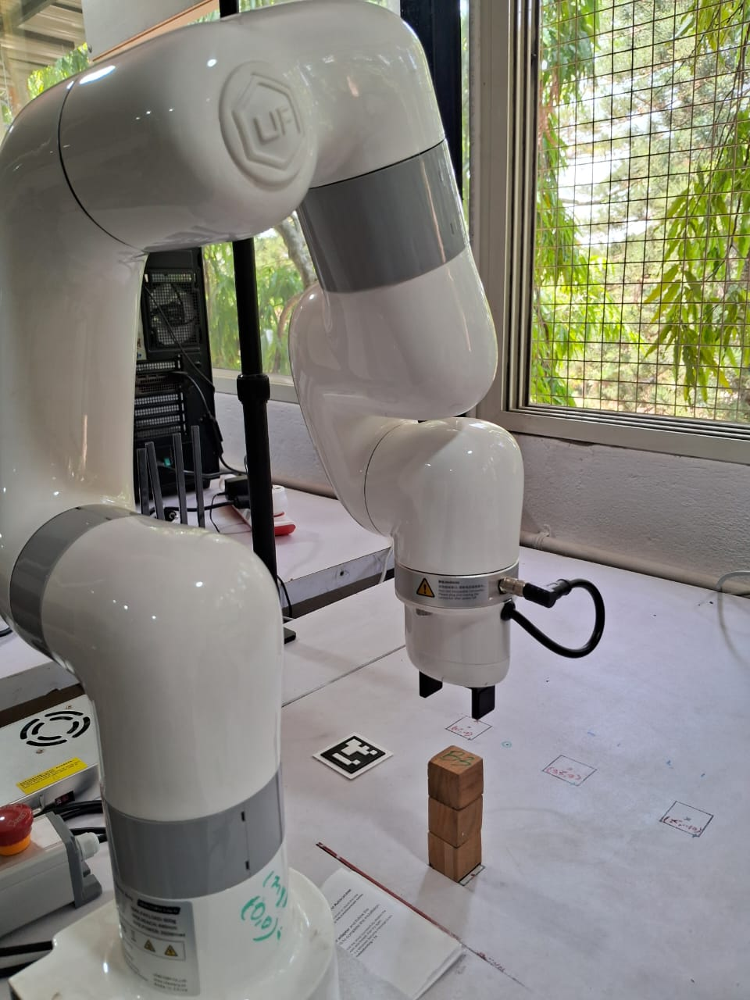

# RAS Workspace Setup Guide

This guide will help you set up your workspace for RAS experiment from scratch.

## Setting Up the Workspace

Follow these steps to prepare your physical workspace for the RAS experiment:

### Step 1: Identify the Robot Base Origin (0,0)
The origin i.e., (0,0) is located at the center of the robot base.



### Step 2: Mark the Home/Stacking Position
Measure 20cm using a scale along the x-axis and mark it as (20,0). This will be the home/stacking position of the robot for this experiment. You can change it to any other position depending on your requirement.



### Step 3: Mark Object Positions
Measure 15cm from the home position (or 35cm from origin) along the x-axis and mark it as (35,0). This will be the point where wooden block/object for the experiment will be placed.

Similarly, you can mark other points for different wooden blocks/objects. In the current experiment, we have 3 marked positions for objects at:
- (35,10) cm
- (35,0) cm
- (35,-10) cm



### Step 4: Place Objects and Initialize Robot
Place the wooden blocks/objects at the points which were measured in the previous step. Start the robot app and move the robot to the home/stacking position.



### Step 5: Run the Experiment
Run the experiment using the command:
```bash
ras_cli run_execute_exp --experiment_name <experiment_name>
```

Example:
```bash
ras_cli run_execute_exp 0_stack
```

### Step 6: Verify Results
After the experiment is completed, you can see the objects are stacked in the order specified in the experiment file on the stacking position.




