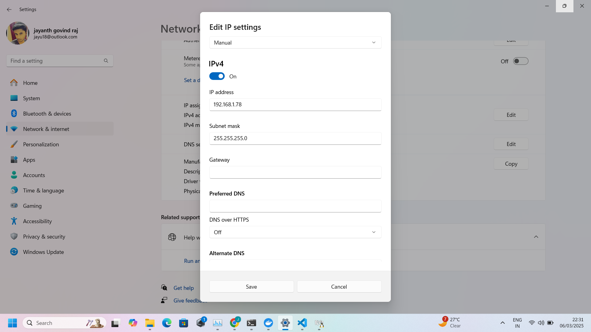

# RAS Docker Walkthrough

This document provides a comprehensive walkthrough of the RAS Docker environment structure and functionality. Use this guide to navigate the codebase and understand how to use the system.

## Directory Structure
```
.
├── apps                   # Contains application-specific code
│   ├── ras_robot_app      # Robot controller application
│   └── ras_server_app     # Server application for remote control and monitoring
├── assets                 # Static assets (images, 3D models, etc.)
├── configs                # Configuration files for the system
│   ├── experiments        # Robot experiment definitions
│   ├── lab_setup.yaml     # Laboratory environment configuration
│   ├── objects.yaml       # Object definitions for manipulation
│   └── ras_conf.yaml      # Main RAS system configuration
├── context                # Docker context files
├── repos                  # External repositories and dependencies
├── ros2_pkgs              # ROS2 packages for robot control
│   ├── ras_bt_framework   # Behavior Tree framework for task execution
│   ├── ras_core_pkgs      # Core ROS2 packages for robot functionality
│   └── ras_sim            # Simulation environment packages
├── scripts                # Utility scripts for various tasks
└── env.sh                 # Environment setup script
```
---
## Prerequisites
Before starting, ensure your system has the following installed:

1. **Ubuntu OS** (RAS officially supports Ubuntu)
2. **Git** (To download the required files)
   ```bash
   sudo apt install git
   ```
3. **Docker** (For running applications in containers)
   ```bash
   sudo apt install docker.io
   ```
   or

   [Docker](https://docs.docker.com/engine/install/ubuntu/)
  
   Verify Docker installation:
   - run the following command to check for the `docker installation`:
   ```bash
   docker
4. **Nvidia Container Toolkit** (If your system have nvidia GPU installed)

   Check for Nvidia GPU,
   ```bash
   nvidia-smi
   ```
   If not installed, it will show versions to install the nvidia drivers.
   
   If already have then run the following command to install nvidia container toolkit.
   ```bash
   sudo apt-get install -y nvidia-container-toolkit
   ```
6. **vcstool** (For managing repositories)
   ```bash
   python3 -m pip install vcstool
   ```
   If pip is not installed:
   ```bash
   sudo apt install python3-pip
   ```
7. **Argcomplete** (For auto-completing commands)
   ```bash
   sudo apt install python3-argcomplete
   ```
8. **Stable Internet Connection** (Required to pull Docker images properly)
9. **xArm Robotic Manipulator** (With Dedicated Desktop Setup for Robot Setup)
10. **Robot Hardware Connection** (For Robot Desktop Setup)
   Use an Ethernet cable to connect the robot and your PC.
   Default IP of xArm: `192.168.1.111`

   Set Manual Ethernet IP Address:
   1. Go to **Settings → Network → Ethernet → IPv4**
   2. Select **Manual** and enter:
      - **IP Address**: `192.168.1.78` (or any IP in the xArm's subnet)
      - **Subnet Mask**: `255.255.255.0`

   

   Check connection:
   ```bash
   ping 192.168.1.111
   ```
   If packets are sent and received successfully, the connection is established.   
---
## Installation

## Step 1: Clone the Repository
Download the RAS Docker workspace files by running:
```bash
git clone --recursive https://github.com/ras-ros2/ras_docker
```
---
## Step 2: Set Up Environment
Go inside the `ras_docker` folder and set up the environment:
```bash
cd ras_docker
```
Source the environment using the following command:
```bash
. env.sh
```
---
## Step 3: Check Available Commands
List available commands for the RAS Docker Interface (RDI):
```bash
ras -h
```
---
## Step 4: Initialize the App
Set up the application:
```bash
ras <app> init
```
`Note:` If the internet is unstable, this command may build the image locally. Run the following command to force pull the image from DockerHub:
```bash
ras <app> init -i
```
This creates the `ras_server_app/ras_robot_app` folder inside the `apps` directory.

---
## Step 5: Build the Application
Build the application:
```bash
ras <app> build
```
This command will build 
- the necessary Docker image for the server.
- the ROS 2 workspace inside the ras_server_app/ros2_ws and ras_robot_app/ros2_ws directory.
If the ROS 2 workspace is not built then run it again.

`Note:` If you've downloaded new images or updated an existing one, make sure to clean the build before rebuilding:
```bash
ras <app> build --clean
```
---
## Step 6: Configure the Network
Before running the <app>, configure `ras_conf.yaml`:
```bash
nano ras_docker/configs/ras_conf.yaml
```
Update transport settings based on your network setup:
### Default: 
Running on the Same Machine (Localhost)
```yaml
ras:
  transport:
    implementation: default
    file_server:
      use_external: false
      ip: localhost
      port: 2122
    mqtt:
      use_external: false
      ip: localhost
      port: 2383
```
For more examples, see [Network Configuration Setup README](Network_configuration_setup_readme.md).

---
## Step 7: Run the App
Start the app inside a Docker container:
```bash
ras <app> run
```
For more details, see [Applications README](tmux_tabs_readme.md).

---
## Step 8: Access the Container
To log into the running <app> container:
```bash
ras <app> dev
```
To exit:
```bash
exit
```
or press `Ctrl + D`.

---
## Step 9: Kill the App
To stop the app, use:
```bash
ras_kill
```
## Done!
Your app is now set up and running. If you face any issues:
- Follow the troubleshooting steps provided.
- Restart your system.
- For docker troubleshooting, [Docker Network and Configuration README](docker_setup_troubleshoot_readme.md).
- For GUI interaction, [UFactory Studio README](UFactory_Studio_App_readme.md).
- Refer this [RAS Server Setup README](RAS_Server_Setup_readme.md). for complete Server Setup.
- Refer this [RAS Robot Setup README](RAS_Robot_Setup_readme.md). for complete Server Setup.
  
For further assistance, refer to the documentation or raise an issue on the project repository.
