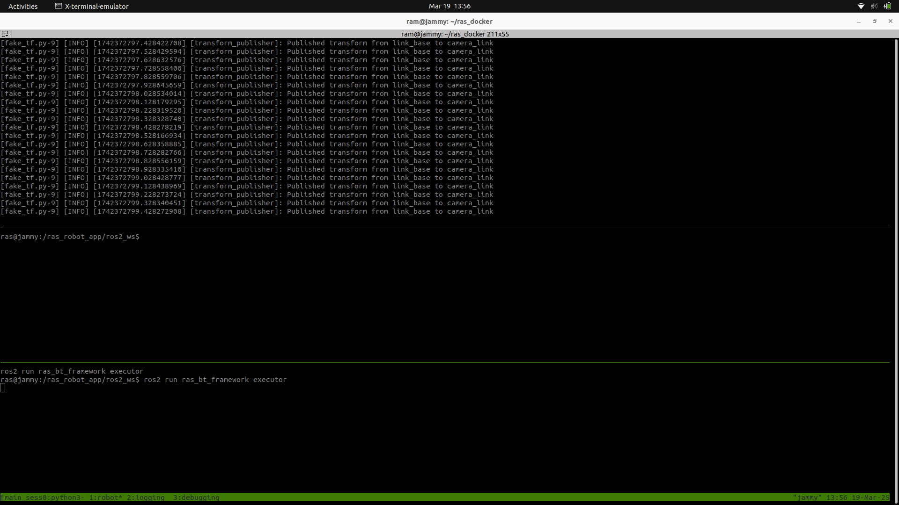

# RAS Server Setup Guide

This guide will help you set up and run the RAS Server Application step by step.

---
## Prerequisites
Before starting, ensure your system has the following installed:

1. **Ubuntu OS** (RAS officially supports Ubuntu)
2. **Git** (To download the required files)
   ```bash
   sudo apt install git
   ```
3. **Docker** (For running applications in containers)
   ```bash
   sudo apt install docker.io
   ```
   or

   [Docker](https://docs.docker.com/engine/install/ubuntu/)
  
   Verify Docker installation:
   - run the following command to check for the `docker installation`:
   ```bash
   docker
   ```
   - run the following command to check the status of the `docker images`:
   ```bash
   docker images
   ```
   If this command returns output, it means the docker images are currently loaded. If it returns nothing, the docker images are not in use.
   
   - run the following command to check for the status of the `docker containers`:
   ```bash
   docker ps
   ```
   If this command returns output, it means the docker container is currently loaded. If it returns nothing, the docker container is not in use.
   
5. **vcstool** (For managing repositories)
   ```bash
   python3 -m pip install vcstool
   ```
   If pip is not installed:
   ```bash
   sudo apt install python3-pip
   ```
6. **Argcomplete** (For auto-completing commands)
   ```bash
   sudo apt install python3-argcomplete
   ```
7. **Stable Internet Connection** (Required to pull Docker images properly)

---
## Installation

## Step 1: Clone the Repository
Download the RAS Docker workspace files by running:
```bash
git clone --recursive https://github.com/ras-ros2/ras_docker
```

---
## Step 2: Set Up Environment
Go inside the `ras_docker` folder and set up the environment:
```bash
cd ras_docker
```
Source the environment using the following command:
```bash
. env.sh
```
---
## Step 3: Docker Setup (Permission Access)

### 1. Add Your User to the Docker Group
To run Docker commands without `sudo`, add your user to the `docker` group:
```bash
sudo usermod -aG docker $USER
```
Log out and log back in or apply changes immediately:
```bash
newgrp docker
```
Now, test with:
```bash
docker ps
```
If it works without `sudo`, the docker setup is successful.
### 2. Use `sudo` for Docker Commands (Alternative)
If you prefer not to modify group permissions, always run Docker commands with `sudo`:
```bash
sudo docker ps
```

### 3. Check Docker Daemon Permissions
Check permissions of the Docker socket file:
```bash
ls -l /var/run/docker.sock
```
It output should look like the following:
```bash
srw-rw---- 1 root docker 0 <current_date> <current_time> /var/run/docker.sock
```
Fix permissions if incorrect:
```bash
sudo chown root:docker /var/run/docker.sock
sudo chmod 660 /var/run/docker.sock
```

### 4. Restart Docker Service
Restart Docker after making changes:
```bash
sudo systemctl restart docker
```

### 5. Check Docker Daemon Status
Ensure Docker is running:
```bash
sudo systemctl status docker
```
If not running, start it:
```bash
sudo systemctl start docker
```

---
## Step 4: Check Available Commands
List available commands for the RAS Docker Interface (RDI):
```bash
ras -h
```

---
## Step 5: Initialize the Server
Set up the server application:
```bash
ras server init
```
`Note:` If the internet is unstable, this command may build the image locally. Run the following command to force pull the image from DockerHub:
```bash
ras server init -i
```
This creates the `ras_server_app` folder inside the `apps` directory.

---
## Step 6: Build the Server Application
Build the server application:
```bash
ras server build
```
This command will build 
- the necessary Docker image for the server.
- the ROS 2 workspace inside the ras_server_app/ros2_ws directory.
If the ROS 2 workspace is not built then run it again.

`Note:` If you've downloaded new images or updated an existing one, make sure to clean the build before rebuilding:
```bash
ras server build --clean
```

---
## Step 7: Configure the Server
Before running the server, configure `ras_conf.yaml`:
```bash
nano ras_docker/configs/ras_conf.yaml
```
Update transport settings based on your network setup:

### 1. Using a Remote IP (Cloud Server)
```yaml
ras:
  transport:
    implementation: default
    file_server:
      use_external: true
      ip: dev2.deepklarity.ai (for example)
      port: 9501
    mqtt:
      use_external: true
      ip: dev2.deepklarity.ai (for example)
      port: 9500
```
### 2. Using a Local Wi-Fi Network
```yaml
ras:
  transport:
    implementation: default
    file_server:
      use_external: false
      ip: <YOUR_WIFI_IP>
      port: 2122
    mqtt:
      use_external: false
      ip: <YOUR_WIFI_IP>
      port: 2383
```
### 3. Running on the Same Machine (Localhost)
```yaml
ras:
  transport:
    implementation: default
    file_server:
      use_external: false
      ip: localhost
      port: 2122
    mqtt:
      use_external: false
      ip: localhost
      port: 2383
```

---
## Step 8: Run the Server
Start the server inside a Docker container:
```bash
ras server run
```
tmux Tabs shows the following files execution after running the server app:
1. main_sess0:
```bash
a. main.launch.py
   Path: ras_docker repo → apps/ras_server_app/ros2_ws/src/ras_app_main/launch/main.launch.py
b. executor.cpp
   Path: ras_bt_framework repo → ras_bt_framework/src/executor.cpp
c. moveit_server.launch.py
   Path: ras_moveit repo → ras_moveit/launch/moveit_server.launch.py
d. TrajectoryRecordsService.py
   Path: apps/ras_server_app/ros2_ws/install/ras_bt_framework/lib/ras_bt_framework/TrajectoryRecordsService.py
```


2. website:
```bash
a. rosbridge_websocket_launch.xml
   Path: apps/ras_server_app/ros2_ws/install/rosbridge_server/share/rosbridge_server/launch/rosbridge_websocket_launch.xml
b. ras_webapp
c. server.launch.py
   path: ras_transport repo→ras_transport/launch/server.launch.py
```


3. experiment:
```bash
a. experiment_service.py
   path: ras_bt_framework repo → ras_bt_framework/scripts/experiment_service.py
b. FakeGripperServer.py
   path: ras_bt_framework repo → ras_bt_framework/scripts/FakeGripperServer.py
```


4. debugging:
```bash
a. spawn_model_node
b. spawn_manager.py:
   path: ras_sim repo→ras_sim/scripts/spawn_manager.py
```


The Rviz and Ignition Gazebo will launch as shown in the below images:


`Note:` If the robot model does not spawn correctly, then go to step 7 → configure the server-robot connection correctly and re-run the server app.

---
## Step 9: Access the Server Container
To log into the running server container:
```bash
ras server dev
```
To exit:
```bash
exit
```
or press `Ctrl + D`.

---
## Step 10: Kill the Server App
To stop the server app, use:
```bash
ras_kill
```
## Done!
Your server is now set up and running. If you face any issues:
- Follow the troubleshooting steps provided.
- Restart your system.
- Check logs inside `ras_server_app`.
- Verify Docker setup and network configurations.

# RAS Robot Setup Guide

This guide will help you set up and run the RAS Robot Application step by step.

## Prerequisites
Before starting, ensure your system has the following installed:

1. **Ubuntu OS** (RAS officially supports Ubuntu)
2. **Git** (To download the required files)
   ```bash
   sudo apt install git
   ```
3. **Docker** (For running applications in containers)
   ```bash
   sudo apt install docker.io
   ```
   or

   [Docker](https://docs.docker.com/engine/install/ubuntu/)
  
   Verify Docker installation:
   - run the following command to check for the `docker installation`:
   ```bash
   docker
   ```
   - run the following command to check the status of the `docker images`:
   ```bash
   docker images
   ```
   If this command returns output, it means the docker images are currently loaded. If it returns nothing, the docker images are not in use.
   
   - run the following command to check for the status of the `docker containers`:
   ```bash
   docker ps
   ```
   If this command returns output, it means the docker container is currently loaded. If it returns nothing, the docker container is not in use.
   
5. **vcstool** (For managing repositories)
   ```bash
   python3 -m pip install vcstool
   ```
   If pip is not installed:
   ```bash
   sudo apt install python3-pip
   ```
6. **Argcomplete** (For auto-completing commands)
   ```bash
   sudo apt install python3-argcomplete
   ```
7. **Stable Internet Connection** (Required to pull Docker images properly)
8. **xarm Robotic Manipulator** (with Dedicated Desktop Setup)

---

## Installation

## Step 1: Clone the Repository
Download the RAS Docker workspace files by running:
```bash
git clone --recursive https://github.com/ras-ros2/ras_docker
```
---
## Step 2: Set Up Environment
Go inside the `ras_docker` folder and set up the environment:
```bash
cd ras_docker
```
Source the environment using the following command:
```bash
. env.sh
```
Switch to the real_robot branch:
```sh
ras vcs version  # Check current branch
ras vcs version real_robot  # Switch to real_robot branch
```
---
## Step 3: Docker Setup (Permission Access)

### 1. Add Your User to the Docker Group
To run Docker commands without `sudo`, add your user to the `docker` group:
```bash
sudo usermod -aG docker $USER
```
Log out and log back in or apply changes immediately:
```bash
newgrp docker
```
Now, test with:
```bash
docker ps
```
If it works without `sudo`, the docker setup is successful.
### 2. Use `sudo` for Docker Commands (Alternative)
If you prefer not to modify group permissions, always run Docker commands with `sudo`:
```bash
sudo docker ps
```

### 3. Check Docker Daemon Permissions
Check permissions of the Docker socket file:
```bash
ls -l /var/run/docker.sock
```
It output should look like the following:
```bash
srw-rw---- 1 root docker 0 <current_date> <current_time> /var/run/docker.sock
```
Fix permissions if incorrect:
```bash
sudo chown root:docker /var/run/docker.sock
sudo chmod 660 /var/run/docker.sock
```

### 4. Restart Docker Service
Restart Docker after making changes:
```bash
sudo systemctl restart docker
```

### 5. Check Docker Daemon Status
Ensure Docker is running:
```bash
sudo systemctl status docker
```
If not running, start it:
```bash
sudo systemctl start docker
```
---
## Step 4: Check Available Commands
List available commands for the RAS Docker Interface (RDI):
```bash
ras -h
```
---
## Step 5: Initialize the Robot
Set up the robot application:
```bash
ras robot init
```
`Note:` If the internet is unstable, this command may build the image locally. Run the following command to force pull the image from DockerHub:
```bash
ras robot init -i
```
This creates the `ras_robot_app` folder inside the `apps` directory.

---
## Step 6: Build the Robot Application
Build the robot application:
```bash
ras robot build
```
This command will build 
- the necessary Docker image for the robot.
- the ROS 2 workspace inside the ras_robot_app/ros2_ws directory.
If the ROS 2 workspace is not built then run it again.

`Note:` If you've downloaded new images or updated an existing one, make sure to clean the build before rebuilding:
```bash
ras robot build --clean
```
---
## Step 7: Configure the Robot
Before running the robot, configure `ras_conf.yaml`:
```bash
nano ras_docker/configs/ras_conf.yaml
```
Update transport settings based on your network setup:

### 1. Using a Remote IP (Cloud Server)
```yaml
ras:
  transport:
    implementation: default
    file_server:
      use_external: true
      ip: dev2.deepklarity.ai (for example)
      port: 9501
    mqtt:
      use_external: true
      ip: dev2.deepklarity.ai (for example)
      port: 9500
```
### 2. Using a Local Wi-Fi Network
```yaml
ras:
  transport:
    implementation: default
    file_server:
      use_external: false
      ip: <YOUR_WIFI_IP>
      port: 2122
    mqtt:
      use_external: false
      ip: <YOUR_WIFI_IP>
      port: 2383
```
### 3. Running on the Same Machine (Localhost)
```yaml
ras:
  transport:
    implementation: default
    file_server:
      use_external: false
      ip: localhost
      port: 2122
    mqtt:
      use_external: false
      ip: localhost
      port: 2383
```
---
### Step 8: Robot Hardware Connection
Use an Ethernet cable to connect the robot and your PC.
Default IP of xarm: `192.168.1.111`

Set Manual Ethernet IP Address:
1. Go to **Settings → Network → Ethernet → IPv4**
2. Select **Manual** and enter:
   - **IP Address**: `192.168.1.78` (or any IP in the xArm's subnet)
   - **Subnet Mask**: `255.255.255.0`


Check connection:
```sh
ping 192.168.1.111
```
If packets are sent and received successfully, the connection is established.

Access the uFactory Studio App:
```
http://192.168.1.111:18333
```


This interface allows you to enable and control the robot.

---
### Step 9: Run the Robot
```sh
ras robot run
```
tmux Tabs shows the following files execution after running the robot app:
1. main_sess0:
```bash
a. robot.launch.py
   path: apps/ras_robot_app/ros2_ws/install/ras_transport/share/ras_transport/launch/robot.launch.py
b. moveit_real_server.launch.py
   path: ras_moveit repo→ ras_moveit/launch/moveit_real_server.launch.py
c. TrajectoryRecordsService.py
   path: apps/ras_robot_app/ros2_ws/install/ras_bt_framework/lib/ras_bt_framework/TrajectoryRecordsService.py
```


2. robot:
```bash
a. real.launch.py
   path: apps/ras_robot_app/ros2_ws/src/ras_app_main/launch/real.launch.py
b. executor.cpp
   path: ras_bt_framework repo→ ras_bt_framework/src/executor.cpp
```


3. experiment:
```bash
a. gripper.py
   path: ras_transport → apps/ras_robot_app/ros2_ws/install/ras_transport/lib/gripper.py
b. logging_manager.py
   path: apps/ras_robot_app/ros2_ws/install/ras_bt_framework/lib/ras_bt_framework/logging_manager.py
```


4. debugging:
```bash
a. aruco_detection.py:
   path: ras_perception/scripts/aruco_detection.py
b. dummy_logging_server.py:
   path: apps/ras_robot_app/ros2_ws/install/ras_bt_framework/lib/ras_bt_framework/dummy_logging_server.py
```


The Rviz and Ignition Gazebo will launch as shown in the below images:


You can control the xarm using the **predefined state** in the **start state**, **goal state** in the Query block as shown in Rviz.
The **orange arm** represents the **goal state** and **white arm** represents the **start state** and it includes different states which can be used to move the real arm using the **plan & execute** button.

If the model does not spawn correctly:
1. Go to **Step 7** and reconfigure the server-robot connection.
2. Check the wired connection.
3. Use **UFactory Studio GUI** to verify the connection.

---
## Step 10: Access the Server Container
To log into the running server container:
```bash
ras server dev
```
To exit:
```bash
exit
```
or press `Ctrl + D`.

---
## Step 11: Kill the Server App
To stop the server app, use:
```bash
ras_kill
```
---
## Done!
Your robot is now set up and running. If you face any issues:
- Follow the troubleshooting steps provided.
- Restart your system.
- Check logs inside `ras_robot_app`.
- Verify Docker setup and network configurations.

For further assistance, refer to the documentation or raise an issue on the project repository.
