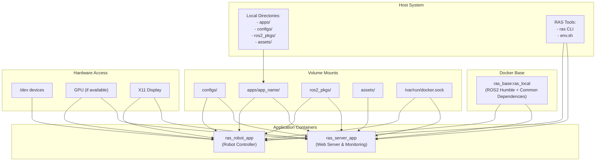

# RAS Docker Architecture

This document provides a comprehensive overview of the Docker architecture used in the RAS (Robotics Application Stack) project, including all containerized services, their relationships, network configuration, and build processes.

## System Architecture



## Docker Images

### Base Image: `ras_base:ras_local`

**Built from:** `osrf/ros:humble-desktop-full`

**Location:** `context/Dockerfile.base`

**Key Dependencies:**
- ROS2 Humble (full desktop)
- ROS2 MoveIt (robot manipulation)
- ROS2 Control framework
- ROS2 Behavior Tree libraries
- Python dependencies:
  - transforms3d
  - pycollada
  - trimesh
  - py_trees
  - AWSIoTPythonSDK
  - Google API clients
- System tools:
  - docker.io
  - tmux

### Robot App: `ras_robot_app:ras_local`

**Built from:** `ras_base:ras_local`

**Location:** `context/apps/Dockerfile.robot`

**Additional Dependencies:**
- Ignition Fortress (simulation)
- xArm-Python-SDK
- Flask
- OpenCV
- Mosquitto MQTT broker
- Network utilities

### Server App: `ras_server_app:ras_local`

**Built from:** `ras_base:ras_local`

**Location:** `context/apps/Dockerfile.server`

**Additional Dependencies:**
- Ignition Fortress
- AWS IoT SDK & boto3
- Node.js 20 (via NVM)
- Flask
- MQTT libraries
- OpenAI SDK

## Network Configuration

Both containers run with `--network host`, which means they share the host's network stack. This allows:

1. Direct communication between containers
2. Access to all host network interfaces 
3. No port mapping required
4. Lower networking overhead

### Key Ports Used

The following ports were identified as being used by the RAS Docker services:

| Service | Port | Container | Description |
|---------|------|-----------|-------------|
| ROS2 Web Bridge | 9090 | Both | ROS2 web bridge for web interfaces |
| Mosquitto MQTT Broker | 2383 | Both | MQTT message broker (non-standard port) |
| Node.js Web Server | 5173 | server_app | Web interface |
| Python Service | 2122 | server_app | Custom Python service |
| ROS2 DDS | Various ephemeral ports | Both | ROS2 communication (DDS protocol) |

### Checking Ports in Use

To check which ports are actually being used by the RAS Docker services:

1. **Start the desired RAS application**:
   ```bash
   source ./env.sh && ras server run
   ```

2. **Check listening ports**:
   ```bash
   sudo lsof -i -P -n | grep LISTEN
   ```

This will show all listening ports on your system. Look for processes like:
- `python3` (ROS2 nodes, Web Bridge)
- `mosquitto` (MQTT broker) 
- `node` (Web server)
- Other ROS2-related processes

Example output:
```
python3   16598             ram   19u  IPv4  64648      0t0  TCP *:9090 (LISTEN)
mosquitto 16632             ram    4u  IPv4  60748      0t0  TCP *:2383 (LISTEN)
node      16578             ram   28u  IPv4  60746      0t0  TCP 127.0.0.1:5173 (LISTEN)
python3   16573             ram    4u  IPv4  62664      0t0  TCP *:2122 (LISTEN)
```

## Volume Mounts

The following host directories are mounted into the containers:

| Host Path | Container Path | Purpose |
|-----------|---------------|---------|
| `apps/ras_*_app/` | `/ras_*_app/` | Application code |
| `configs/` | `/ras_*_app/configs/` | Configuration files |
| `ros2_pkgs/` | `/ras_*_app/ros2_ws/src/common_pkgs/` | ROS2 packages |
| `assets/` | `/ras_server_app/ros2_ws/src/assets/` | Static assets (server only) |
| `/var/run/docker.sock` | `/var/run/docker.sock` | Docker socket (for container management) |
| `/dev/` | `/dev/` | Device access |
| `/tmp/.X11-unix` | `/tmp/.X11-unix` | X11 display socket |

## Build Process

### Image Building

The Docker images are built in a hierarchical manner:

1. **Base Image:**
   ```bash
   # Built from context/Dockerfile.base
   docker build -t ras_base:ras_local -f Dockerfile.base .
   ```

2. **Application Images:**
   ```bash
   # Robot App (from context/apps/Dockerfile.robot)
   docker build -t ras_robot_app:ras_local -f apps/Dockerfile.robot .
   
   # Server App (from context/apps/Dockerfile.server)
   docker build -t ras_server_app:ras_local -f apps/Dockerfile.server .
   ```

This process is automated through the `ras <app> build --force` command, which rebuilds the Docker image when necessary.

### ROS2 Workspace Building

After the Docker image is built (or reused), the ROS2 workspace inside the container is built:

```bash
# Inside the container
cd /ras_*_app/scripts && ./setup.sh
cd /ras_*_app/ros2_ws && colcon build --symlink-install
```

This process compiles the ROS2 packages that are mounted from the host filesystem.

## Runtime Architecture

### Robot App Container

The Robot App container provides:

- Robot hardware interface
- Motion planning & control
- Perception processing
- Task execution via Behavior Trees
- Simulation capabilities (Ignition)
- MQTT communication

### Server App Container

The Server App container provides:

- Web interface for monitoring and control
- Remote visualization
- Data storage and logging
- API endpoints for external integration
- MQTT broker for message passing

### Interaction between Containers

The containers interact primarily through:

1. **ROS2 Topics**: Using DDS middleware for real-time communication
2. **MQTT Messages**: For event-based communication
3. **HTTP API**: For command and control operations

## Usage and Management

### Creating Containers

Containers are created using the RAS Docker Interface (RDI) tool:

```bash
# Initialize the app directory
ras <app> init

# Build the Docker image & ROS2 workspace
ras <app> build

# Run the application
ras <app> run
```

### Development Workflow

For development:

```bash
# Access a running container shell
ras <app> dev

# Build only the ROS2 workspace (without rebuilding Docker image)
ras <app> build
```

### Container Lifecycle Management

```bash
# Kill running containers
ras <app> kill

# Commit changes to a Docker image
ras <app> commit
```

## Environment Variables

Important environment variables used:

| Variable | Purpose |
|----------|---------|
| RAS_DOCKER_PATH | Root path of the RAS Docker project |
| DISPLAY | X11 display for GUI applications |
| RMW_IMPLEMENTATION | ROS2 DDS implementation (default: CycloneDDS) |

## Key Configuration Files

| File | Purpose |
|------|---------|
| env.sh | Environment setup script |
| apps/*/scripts/setup.sh | App-specific setup script |
| apps/*/scripts/env.sh | App-specific environment variables |
| configs/ras_conf.yaml | Main RAS system configuration |

## Using Prebuilt Images vs. Building Locally

The system supports both options:

1. **Using Prebuilt Images** (`ras <app> build`):
   - Faster setup
   - Consistent environment
   - Requires only code changes to be built

2. **Building from Scratch** (`ras <app> build --force`):
   - Complete control over dependencies
   - Useful when dependencies change
   - Takes longer but ensures latest versions

## Troubleshooting

Common issues and solutions:

1. **X11 Display Issues**: Ensure proper DISPLAY environment variable and X11 permissions (`xhost +local:root`)
2. **Device Access Problems**: Check device permissions in `/dev` and consider adding your user to relevant groups
3. **Network Conflicts**: Check for port conflicts on the host machine
4. **Build Failures**: Use clean build option (`ras <app> build --clean`) to start fresh
