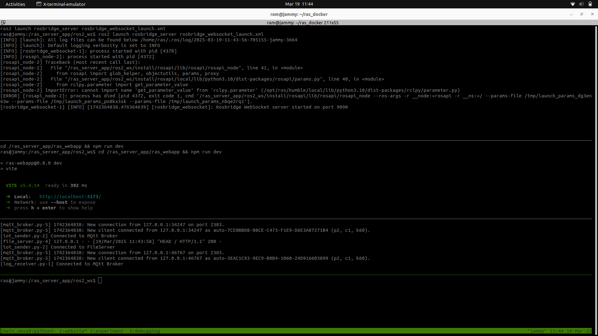
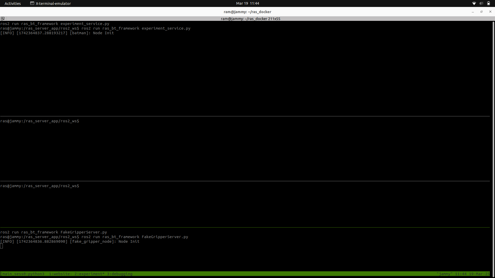
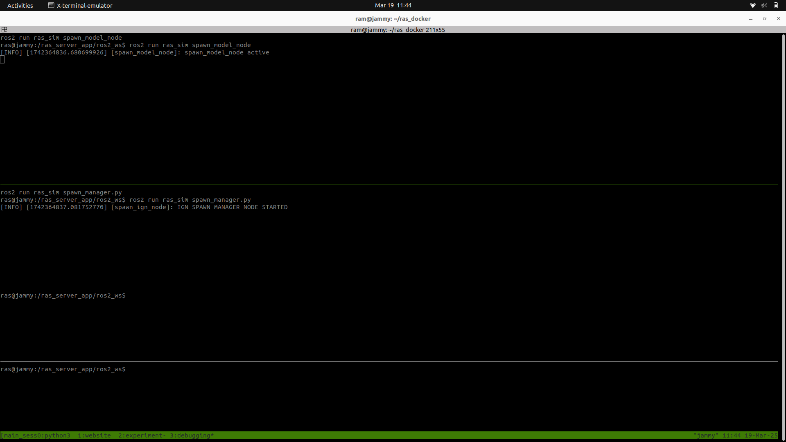

## RAS Server App
tmux Tabs shows the following files execution after running the server app:
1. main_sess0:
```bash
a. main.launch.py
   Path: ras_docker repo → apps/ras_server_app/ros2_ws/src/ras_app_main/launch/main.launch.py
b. executor.cpp
   Path: ras_bt_framework repo → ras_bt_framework/src/executor.cpp
c. moveit_server.launch.py
   Path: ras_moveit repo → ras_moveit/launch/moveit_server.launch.py
d. TrajectoryRecordsService.py
   Path: apps/ras_server_app/ros2_ws/install/ras_bt_framework/lib/ras_bt_framework/TrajectoryRecordsService.py
```


2. website:
```bash
a. rosbridge_websocket_launch.xml
   Path: apps/ras_server_app/ros2_ws/install/rosbridge_server/share/rosbridge_server/launch/rosbridge_websocket_launch.xml
b. ras_webapp
c. server.launch.py
   path: ras_transport repo→ras_transport/launch/server.launch.py
```


3. experiment:
```bash
a. experiment_service.py
   path: ras_bt_framework repo → ras_bt_framework/scripts/experiment_service.py
b. FakeGripperServer.py
   path: ras_bt_framework repo → ras_bt_framework/scripts/FakeGripperServer.py
```


4. debugging:
```bash
a. spawn_model_node
b. spawn_manager.py:
   path: ras_sim repo→ras_sim/scripts/spawn_manager.py
```


The Rviz and Ignition Gazebo will launch as shown in the below images:


`Note:` If the robot model does not spawn correctly, then go to step 7 → configure the server-robot connection correctly and re-run the server app.

## RAS Robot App
tmux Tabs shows the following files execution after running the robot app:
1. main_sess0:
```bash
a. robot.launch.py
   path: apps/ras_robot_app/ros2_ws/install/ras_transport/share/ras_transport/launch/robot.launch.py
b. moveit_real_server.launch.py
   path: ras_moveit repo→ ras_moveit/launch/moveit_real_server.launch.py
c. TrajectoryRecordsService.py
   path: apps/ras_robot_app/ros2_ws/install/ras_bt_framework/lib/ras_bt_framework/TrajectoryRecordsService.py
```


2. robot:
```bash
a. real.launch.py
   path: apps/ras_robot_app/ros2_ws/src/ras_app_main/launch/real.launch.py
b. executor.cpp
   path: ras_bt_framework repo→ ras_bt_framework/src/executor.cpp
```


3. experiment:
```bash
a. gripper.py
   path: ras_transport → apps/ras_robot_app/ros2_ws/install/ras_transport/lib/gripper.py
b. logging_manager.py
   path: apps/ras_robot_app/ros2_ws/install/ras_bt_framework/lib/ras_bt_framework/logging_manager.py
```


4. debugging:
```bash
a. aruco_detection.py:
   path: ras_perception/scripts/aruco_detection.py
b. dummy_logging_server.py:
   path: apps/ras_robot_app/ros2_ws/install/ras_bt_framework/lib/ras_bt_framework/dummy_logging_server.py
```


The Rviz will launch as shown in the below image:


You can control the xarm using the **predefined state** in the **start state**, **goal state** in the Query block as shown in Rviz.
The **orange arm** represents the **goal state** and **white arm** represents the **start state** and it includes different states which can be used to move the real arm using the **plan & execute** button.

If the model does not spawn correctly:
1. Go to **Step 7** and reconfigure the server-robot connection.
2. Check the wired connection.
3. Use **UFactory Studio GUI** to verify the connection.
